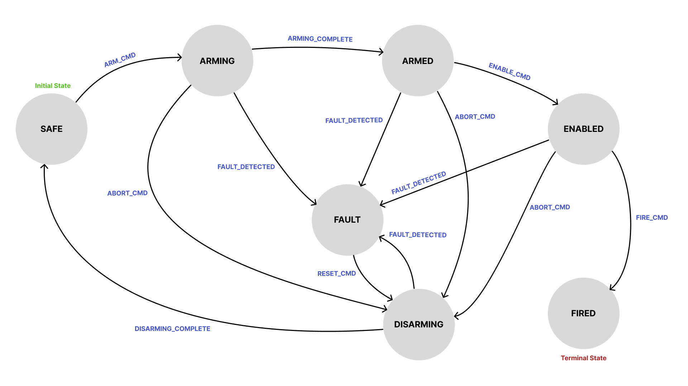
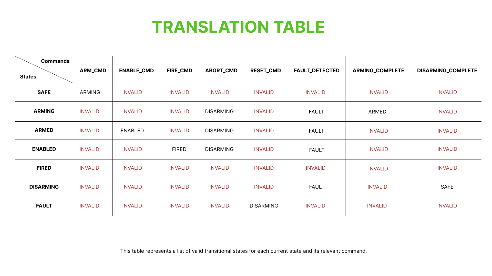

# C State Machine

The Phase I flagship project: a finite state machine written in C that models the
arming and disarming sequence of a notional weapon system, in the
embedded-software style I expect to work in at BAE Systems Maritime Services.

It runs as a console simulation — commands are fed in and the machine logs its
state transitions and the action taken at each step to standard output. There is
no real hardware involved; the value is in the patterns, not the payload.

## Why this project

An arming/disarming sequence is a good vehicle for embedded C because it forces
the patterns that matter in the domain to the surface:

- a small, well-defined set of states with strictly controlled transitions;
- a hard requirement that anything unexpected ends up in a safe fault state
  rather than undefined behaviour;
- timing constraints, modelled here with watchdog timers;
- and a deliberate avoidance of dynamic memory.

It is also the through-line of the whole prep plan: this exact machine is ported
to Ada and SPARK in Phase II, so building it carefully in C first means I
understand the problem deeply before changing language.

## The model

The system is a safety sequence that moves from a fully safe state, through a
controlled arming process, to a terminal fired state — with a fault state
reachable from almost anywhere and a disarming path back to safe. The full state
and command reference is in [`design/state-diagram.md`](design/state-diagram.md).



Transitions are driven by a table: for each (state, command) pair the table gives
the next state, or marks the pair invalid. Invalid combinations are rejected
explicitly rather than ignored silently.



## Architecture

The program is built from small, single-purpose translation units behind headers
in `include/`:

| Module | Responsibility |
|--------|----------------|
| `state_machine` | The main arming sequence: states, the transition table, and `dispatch`. |
| `interlock` | A second, cooperating state machine modelling the physical safety interlock — a hatch that opens and closes. |
| `router` | Routes an incoming command to whichever machine(s) should handle it, using a routing table. |
| `event_queue` | A fixed-size ring buffer that decouples event submission from processing. |
| `actions` | Entry and exit action functions for each state, wired up through function-pointer tables. |
| `watchdog` / `clock` | A simulated tick clock and per-state watchdog timers for detecting stalls and timeouts. |
| `events` | The shared command enumeration and string helpers. |

How a command flows:

1. Commands are enqueued onto the event queue.
2. The main loop ticks the clock and drains the queue.
3. Each command goes to the router, which dispatches it to the main machine, the
   interlock machine, or both.
4. `dispatch` validates the command, looks up the next state in the transition
   table, runs the current state's exit action, changes state, arms the watchdog
   if the new state is time-bounded, and runs the new state's entry action.
5. A command that is simply not valid in the current state is rejected and
   logged, and the machine stays where it is. An out-of-range state or command,
   or an entry action that reports failure, instead drives the machine into
   `FAULT` — the safe default. Faults are also modelled as a first-class
   `FAULT_DETECTED` command, which the watchdog raises on a timeout.

The two machines cooperate: the main sequence only advances from `ARMING` to
`ARMED` (and from `DISARMING` back to `SAFE`) once the interlock reports that the
physical mechanism has finished opening or closing. This is a deliberate
refinement of the original single-machine sketch in `design/` — separating the
logical sequence from the physical mechanism it depends on is closer to how a
real embedded system would be decomposed.

`main.c` is a demonstration harness. It scripts a representative arm → abort →
disarm cycle, then deliberately induces a stall so the watchdog trips and drives
the machines into the fault state, exercising the timeout path end to end.

## Layout

```
c-state-machine/
├── design/    # State diagram, translation table, and design notes
├── include/   # Public headers, one per module
├── src/       # Implementation
├── tests/     # Unit test harness (in progress)
└── README.md
```

## Build and run

The project is plain C99 with no external dependencies:

```sh
gcc -Wall -Wextra -std=c99 -Iinclude -o state_machine src/*.c
./state_machine
```

## What I am learning

This project is where the Phase I concepts have to fit together. The patterns it
has taught me, roughly in the order they mattered:

- **Table-driven state machines.** Encoding transitions as data in a
  `[state][command]` table keeps the logic declarative and auditable, instead of
  a sprawl of nested `switch` statements.
- **Making illegal transitions explicit.** A sentinel value marks every invalid
  (state, command) pair, so an unexpected command is a defined, rejected event
  rather than a silent gap.
- **Designing for the fault path first.** Faults are first-class: `FAULT_DETECTED`
  is a command in its own right — the watchdog raises it on a timeout — and any
  corrupt state, corrupt command, or failed entry action falls back to a single
  safe `FAULT` state. Separating "not allowed here" (reject and stay) from
  "something is wrong" (fail safe) is a distinction the embedded context makes you
  take seriously.
- **Static memory discipline.** The event queue is a fixed-size ring buffer, and
  there is no `malloc` or `free` anywhere. Memory use is bounded and known at
  compile time, as it has to be on a constrained target.
- **Decoupling with an event queue.** Separating "an event happened" from
  "process the next event" is the small abstraction that makes the control flow
  predictable and the system testable.
- **Composition through routing.** A routing table lets one event fan out to
  multiple state machines, and the two-machine design shows how independent
  components coordinate without being tangled together.
- **Function-pointer action tables.** Per-state entry and exit behaviour is wired
  through tables of function pointers — a common embedded idiom for keeping
  dispatch uniform and data-driven.
- **Watchdogs and timing.** A tick clock plus per-state watchdog timers introduce
  the idea that, in an embedded system, a state taking too long is itself a fault
  to be detected and handled.

## Status and next steps

The core machine, interlock, router, event queue, watchdog, and actions are all
implemented, and the demonstration runs end to end. Remaining work, following the
project plan:

- finish the assert-based unit test harness in `tests/`;
- record the key design choices in `design/decisions.md`;
- then port the whole system to Ada 2012 and add SPARK contracts in Phase II.
