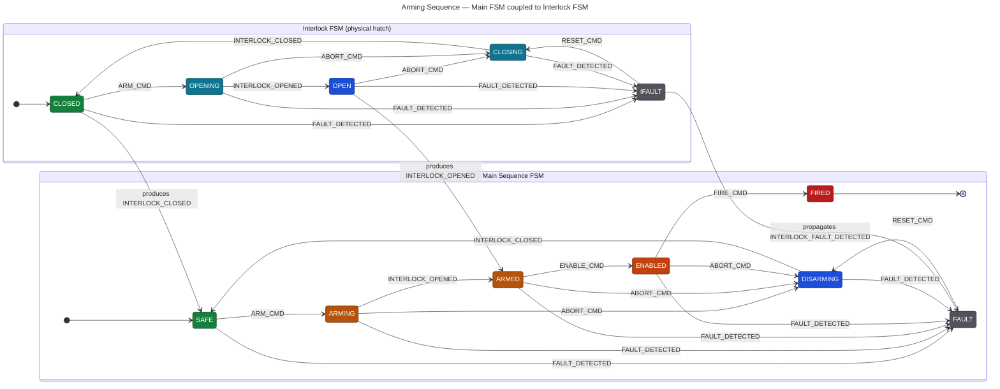

# State Diagram

## Overview

This project implements two cooperating finite state machines that together
model the arming and disarming sequence of a notional weapon system, in the
embedded-software style expected at BAE Systems Maritime Services. The goal is to
practise real-world embedded state-machine patterns — table-driven transitions,
static memory, deterministic control flow, and fail-safe fault handling —
alongside the supporting concepts of safety interlocks, watchdog timers, RTOS
scheduling, and command routing.

Everything here runs as a console simulation. Commands are fed in, and each
machine logs its state transitions and the action taken at every step to standard
output. There is no real hardware and nothing operational; the value is in the
patterns, not the payload.

The system is split into two machines deliberately:

- The **main sequence FSM** models the *logical* arming sequence — the controlled
  progression from a fully safe state through to firing, and back.
- The **interlock FSM** models the *physical* safety interlock — a hatch that
  must open before the system can finish arming and close before it can return to
  safe.

Separating the logical sequence from the physical mechanism it depends on is
closer to how a real embedded system is decomposed, and it is the central reason
the two machines must coordinate rather than run independently.

---

## Diagram

The three edges at the bottom of the diagram cross from the interlock into the
main machine: they show that the interlock reaching `OPEN`, `CLOSED`, or its fault
state is what *produces* the signals (`INTERLOCK_OPENED`, `INTERLOCK_CLOSED`,
`INTERLOCK_FAULT_DETECTED`) that the main machine then consumes. The coupling is
described in full in [Coupling between the machines](#coupling-between-the-machines).

---

## Runtime model

The two machines do not call each other. They communicate only through a shared
event queue, drained by a single driving loop:

1. A fixed-size **event queue** (a 16-slot ring buffer, no dynamic allocation)
   holds pending commands. Submitting an event is decoupled from processing it.
2. On each pass, the driving loop advances a simulated **clock tick**, then
   drains every queued event.
3. Each event is handed to the **router**, which forwards it to the main machine,
   the interlock machine, or both, according to a routing table.
4. A machine's **dispatch** function validates the event against its current
   state, runs the current state's exit action, changes state, arms a watchdog if
   the new state is time-bounded, and runs the new state's entry action.
5. After draining the queue, the loop checks both machines' **watchdogs**. If
   either has exceeded its limit, the loop raises `FAULT_DETECTED`, which is then
   routed to both machines on the next pass.

Memory use is bounded and known at compile time throughout — the queue is fixed
size and there is no `malloc`/`free` anywhere, as is required on a constrained
target.

---

## Commands

There are nine commands, grouped by where they originate. The routing column
records which machine(s) each command is delivered to.

| Command | Origin | Routed to | Meaning |
|---------|--------|-----------|---------|
| `ARM_CMD` | Operator | Main + Interlock | Begin arming: main `SAFE → ARMING`, interlock begins opening |
| `ENABLE_CMD` | Operator | Main only | Operator commitment to fire: `ARMED → ENABLED` |
| `FIRE_CMD` | Operator | Main only | Deploy: `ENABLED → FIRED` |
| `ABORT_CMD` | Operator | Main + Interlock | Abort and unwind: main `→ DISARMING`, interlock begins closing |
| `RESET_CMD` | Operator | Main + Interlock | Recover from a fault: main `FAULT → DISARMING`, interlock `FAULT → CLOSING` |
| `FAULT_DETECTED` | System (watchdog) | Main + Interlock | A stall or generic fault was detected; drives both machines to their fault state |
| `INTERLOCK_OPENED` | Interlock sensor | Main + Interlock | Hatch has finished opening: interlock `OPENING → OPEN`, and unlocks main `ARMING → ARMED` |
| `INTERLOCK_CLOSED` | Interlock sensor | Main + Interlock | Hatch has finished closing: interlock `CLOSING → CLOSED`, and unlocks main `DISARMING → SAFE` |
| `INTERLOCK_FAULT_DETECTED` | Interlock | Main + Interlock | A fault in the physical interlock; drives both machines to their fault state |

Note that there is no `ARMING_COMPLETE` or `DISARMING_COMPLETE` command. Earlier
sketches of this design used those names; in the implementation, completion of
arming and disarming is signalled by the interlock itself via `INTERLOCK_OPENED`
and `INTERLOCK_CLOSED`. This is the most important consequence of splitting the
mechanism into its own machine.

---

## Main sequence FSM

Initial state: `SAFE`. Sole terminal state: `FIRED`.

### Quick reference

| State | Valid transitions |
|-------|-------------------|
| `SAFE` | `ARM_CMD → ARMING`; `FAULT_DETECTED`/`INTERLOCK_FAULT_DETECTED → FAULT` |
| `ARMING` | `INTERLOCK_OPENED → ARMED`; `ABORT_CMD → DISARMING`; `FAULT_DETECTED`/`INTERLOCK_FAULT_DETECTED → FAULT` |
| `ARMED` | `ENABLE_CMD → ENABLED`; `ABORT_CMD → DISARMING`; `FAULT_DETECTED`/`INTERLOCK_FAULT_DETECTED → FAULT` |
| `ENABLED` | `FIRE_CMD → FIRED`; `ABORT_CMD → DISARMING`; `FAULT_DETECTED`/`INTERLOCK_FAULT_DETECTED → FAULT` |
| `FIRED` | — *(terminal)* |
| `FAULT` | `RESET_CMD → DISARMING` |
| `DISARMING` | `INTERLOCK_CLOSED → SAFE`; `FAULT_DETECTED`/`INTERLOCK_FAULT_DETECTED → FAULT` |

### States

**`SAFE`** — the initial state. All safety mechanisms are active, making accidental
firing physically impossible. The only operational move is `ARM_CMD`.

**`ARMING`** — entered on `ARM_CMD`. The safety mechanisms are being removed in a
controlled sequence. The machine does *not* advance to `ARMED` on its own: it
waits for the interlock to confirm the hatch has finished opening
(`INTERLOCK_OPENED`). An operator may `ABORT_CMD` at any point to begin
disarming. This state is time-bounded by a watchdog (see below).

**`ARMED`** — reached once the interlock reports `INTERLOCK_OPENED`. The system is
ready, but firing requires a deliberate, separate operator commitment. The
machine waits here for `ENABLE_CMD`. `ABORT_CMD` still returns to disarming.

**`ENABLED`** — reached on `ENABLE_CMD`. This is the two-step commitment: `ARMED`
means the *system* is ready; `ENABLED` means the *operator* has separately
committed. Only now is `FIRE_CMD` accepted. `ABORT_CMD` still returns to
disarming.

**`FIRED`** — the sole terminal state, reached on `FIRE_CMD`. No transitions leave
it.

**`FAULT`** — the safe default. Any out-of-range state or command, any failed entry
action, a watchdog timeout (`FAULT_DETECTED`), or an interlock fault
(`INTERLOCK_FAULT_DETECTED`) lands here. It is recoverable: `RESET_CMD` begins a
controlled return through `DISARMING`. The state is also a diagnostic anchor — the
logs record exactly when and from where the machine entered it.

**`DISARMING`** — entered on `ABORT_CMD` (from `ARMING`, `ARMED`, or `ENABLED`) or
on `RESET_CMD` (from `FAULT`). The safety mechanisms are re-established in
sequence. As with arming, the machine waits for the interlock — here for
`INTERLOCK_CLOSED` — before returning to `SAFE`. This state is time-bounded by a
watchdog.

---

## Interlock FSM

Initial state: `CLOSED`. The interlock models a physical hatch and its two
in-motion states.

### Quick reference

| State | Valid transitions |
|-------|-------------------|
| `CLOSED` | `ARM_CMD → OPENING`; `FAULT_DETECTED`/`INTERLOCK_FAULT_DETECTED → FAULT` |
| `OPENING` | `INTERLOCK_OPENED → OPEN`; `ABORT_CMD → CLOSING`; `FAULT_DETECTED`/`INTERLOCK_FAULT_DETECTED → FAULT` |
| `OPEN` | `ABORT_CMD → CLOSING`; `FAULT_DETECTED`/`INTERLOCK_FAULT_DETECTED → FAULT` |
| `CLOSING` | `INTERLOCK_CLOSED → CLOSED`; `FAULT_DETECTED`/`INTERLOCK_FAULT_DETECTED → FAULT` |
| `FAULT` | `RESET_CMD → CLOSING` |

### States

**`CLOSED`** — the resting state; the hatch is shut and the system is mechanically
safe. `ARM_CMD` begins driving it open.

**`OPENING`** — the hatch is in motion. When it completes, the sensor raises
`INTERLOCK_OPENED` and the machine moves to `OPEN`. `ABORT_CMD` reverses it into
`CLOSING`. Time-bounded by a watchdog.

**`OPEN`** — the hatch is fully open and held. The only operational move is
`ABORT_CMD`, which begins closing.

**`CLOSING`** — the hatch is being driven shut. When it completes, the sensor raises
`INTERLOCK_CLOSED` and the machine returns to `CLOSED`. Time-bounded by a
watchdog.

**`FAULT`** — entered on any detected fault while moving or resting. Recovery is via
`RESET_CMD`, which drives the hatch back through `CLOSING` to a known-safe
`CLOSED` rather than assuming its position.

---

## Coupling between the machines

The two machines are wired together in three distinct ways.

### 1. Shared operator commands

`ARM_CMD`, `ABORT_CMD`, and `RESET_CMD` are routed to *both* machines in the same
tick. A single `ARM_CMD` therefore starts the logical sequence (`SAFE → ARMING`)
and the physical mechanism (`CLOSED → OPENING`) together. Likewise `ABORT_CMD`
sends the main machine to `DISARMING` while the interlock begins `CLOSING`, and
`RESET_CMD` recovers both from their fault states at once.

### 2. The interlock gates the main sequence

This is the defining coupling. The main machine cannot complete arming or
disarming on its own:

- `ARMING → ARMED` happens only when the interlock finishes opening and emits
  `INTERLOCK_OPENED`.
- `DISARMING → SAFE` happens only when the interlock finishes closing and emits
  `INTERLOCK_CLOSED`.

So the logical sequence is held until the physical mechanism confirms it has
reached the corresponding position — exactly the safety property the split was
designed to enforce.

### 3. Fault propagation

`INTERLOCK_FAULT_DETECTED` is routed to both machines, so a fault in the physical
interlock forces the main sequence into `FAULT` as well. Conversely, a
system-level `FAULT_DETECTED` (for example from a watchdog timeout) is routed to
both, so neither machine is left running while the other has failed.

### Routing order

The router deliberately orders the two dispatches depending on the command's
origin:

- For interlock-originated signals (`INTERLOCK_OPENED`, `INTERLOCK_CLOSED`,
  `INTERLOCK_FAULT_DETECTED`), the **interlock is dispatched first**, then the
  main machine — the physical state updates before the logical sequence reacts to
  the signal it produced.
- For all other commands (operator commands and `FAULT_DETECTED`), the **main
  machine is dispatched first**, then the interlock.

### Watchdogs as a backstop

Each in-motion state is time-bounded, and the limits are chosen so the main
sequence's wait is a longer backstop over the interlock's movement:

| Machine | State | Timeout (ticks) | Purpose |
|---------|-------|-----------------|---------|
| Main | `ARMING` | 800 | Backstop over the interlock opening |
| Main | `DISARMING` | 800 | Backstop over the interlock closing |
| Interlock | `OPENING` | 500 | Hatch driving open |
| Interlock | `CLOSING` | 500 | Hatch driving closed |

All other states have no timeout. If the interlock's sensor never reports
completion, its own 500-tick watchdog trips first; the main machine's 800-tick
watchdog is the outer guard. A trip in either machine causes the driving loop to
raise `FAULT_DETECTED`.

---

## Fault-handling semantics

Each machine's `dispatch` distinguishes three outcomes, which is the practical
expression of "design for the fault path first":

1. **Reject and stay.** If the transition table marks the `(state, command)` pair
   invalid, the command is logged and rejected, and the machine stays where it
   is. "Not allowed here" is a defined, non-destructive event — not a silent gap.
2. **Fail safe to `FAULT`.** If the current state or incoming command is
   out of range, or a state's entry action reports failure, the machine is driven
   to `FAULT` immediately. "Something is wrong" is always resolved by moving to
   the safe state.
3. **Transition.** For a valid pair, the machine runs the current state's exit
   action, changes state, arms the watchdog if the new state is time-bounded, and
   runs the new state's entry action.

`FAULT` is recoverable in both machines via `RESET_CMD`, which returns them
through a controlled close/disarm rather than jumping straight back to the
resting state. `FIRED` is the only genuine dead-end in the system.

---

## Demonstration scenario

The bundled harness scripts a representative arm-then-abort cycle by enqueuing,
in order:

`ARM_CMD` → `INTERLOCK_OPENED` → `ABORT_CMD` → `INTERLOCK_CLOSED`

which exercises the coupling end to end:

| Step | Main FSM | Interlock FSM |
|------|----------|----------------|
| `ARM_CMD` | `SAFE → ARMING` | `CLOSED → OPENING` |
| `INTERLOCK_OPENED` | `ARMING → ARMED` | `OPENING → OPEN` |
| `ABORT_CMD` | `ARMED → DISARMING` | `OPEN → CLOSING` |
| `INTERLOCK_CLOSED` | `DISARMING → SAFE` | `CLOSING → CLOSED` |

Both machines return cleanly to their resting states. The watchdog/`FAULT_DETECTED`
path is wired into the driving loop as the backstop for a stall, and the
`FIRE_CMD → FIRED` and fault paths are available to be exercised by extending the
scripted events.

---

## Relationship to Phase II

This model is carried directly into Phase II, where the same two machines are
re-implemented in Ada 2012 and then verified with SPARK contracts. Building it
carefully in C first means the problem — the states, the transitions, and the
coupling described above — is fully understood before the language and its prover
change underneath it.
