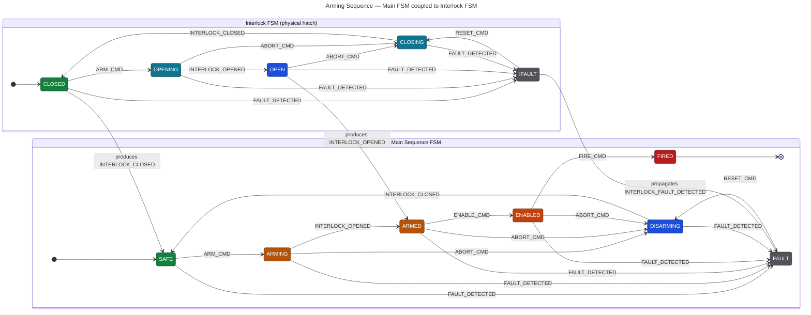

```mermaid
---
title: Arming Sequence — Main FSM coupled to Interlock FSM
---
stateDiagram-v2
    direction LR

    state "Main Sequence FSM" as Main {
        direction TB
        [*] --> SAFE
        SAFE --> ARMING : ARM_CMD
        ARMING --> ARMED : INTERLOCK_OPENED
        ARMED --> ENABLED : ENABLE_CMD
        ENABLED --> FIRED : FIRE_CMD
        FIRED --> [*]

        ARMING --> DISARMING : ABORT_CMD
        ARMED --> DISARMING : ABORT_CMD
        ENABLED --> DISARMING : ABORT_CMD
        DISARMING --> SAFE : INTERLOCK_CLOSED
        FAULT --> DISARMING : RESET_CMD

        SAFE --> FAULT : FAULT_DETECTED
        ARMING --> FAULT : FAULT_DETECTED
        ARMED --> FAULT : FAULT_DETECTED
        ENABLED --> FAULT : FAULT_DETECTED
        DISARMING --> FAULT : FAULT_DETECTED
    }

    state "Interlock FSM (physical hatch)" as Interlock {
        direction TB
        [*] --> CLOSED
        CLOSED --> OPENING : ARM_CMD
        OPENING --> OPEN : INTERLOCK_OPENED
        OPEN --> CLOSING : ABORT_CMD
        OPENING --> CLOSING : ABORT_CMD
        CLOSING --> CLOSED : INTERLOCK_CLOSED
        IFAULT --> CLOSING : RESET_CMD

        CLOSED --> IFAULT : FAULT_DETECTED
        OPENING --> IFAULT : FAULT_DETECTED
        OPEN --> IFAULT : FAULT_DETECTED
        CLOSING --> IFAULT : FAULT_DETECTED
    }

    OPEN --> ARMED : produces INTERLOCK_OPENED
    CLOSED --> SAFE : produces INTERLOCK_CLOSED
    IFAULT --> FAULT : propagates INTERLOCK_FAULT_DETECTED

    classDef safe fill:#15803d,stroke:#0b3d1f,color:#ffffff
    classDef arming fill:#b45309,stroke:#5c2a05,color:#ffffff
    classDef enabled fill:#c2410c,stroke:#5e1f06,color:#ffffff
    classDef fired fill:#b91c1c,stroke:#5c0d0d,color:#ffffff
    classDef fault fill:#52525b,stroke:#27272a,color:#ffffff
    classDef disarm fill:#1d4ed8,stroke:#0f2a73,color:#ffffff
    classDef moving fill:#0e7490,stroke:#073946,color:#ffffff

    class SAFE safe
    class ARMING arming
    class ARMED arming
    class ENABLED enabled
    class FIRED fired
    class FAULT fault
    class DISARMING disarm
    class CLOSED safe
    class OPENING moving
    class CLOSING moving
    class OPEN disarm
    class IFAULT fault
```
